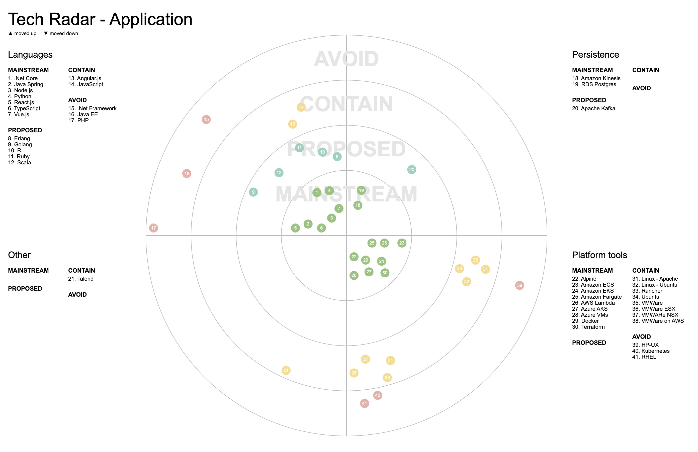

# 4. Language and framework

**Date:** 2022-11-29
**Status:** Accepted

## Context

The language and framework are a core component of any service we build. The
decision of which one to use will affect the speed of delivery and
maintainability of the service. For the purpose of the initial prototyping stage
it is useful to choose a framework that will lend itself to speed and ease of
use.

Across the NHS several languages and frameworks are in use. Here is a brief
summary of findings looking at some of the repos and projects we have access to:

- **[NHS Digital GitHub Repositories](https://github.com/NHSDigital/)** -
  Various repos using Python, Javascript/Typescript and Ruby (ordered by
  repository count)
- **[NHSUK GitHub Repositories](https://github.com/nhsuk)** - Various repos
  using Javascript (many which are prototypes) or Python (many of which are
  libraries/support repos or archived). Examples of services:
- **[NHS.UK Connect To
  Services](https://github.com/nhsuk/connecting-to-services)** - Javascript
- **[National Booking System
  (NBS)](https://nhsd-confluence.digital.nhs.uk/display/CVB1/National+Booking+Service+Technical+Run+Book)** -
  ASP.NET Core
- **[Direct Data Access Platform
  (DDA)](https://nhsd-confluence.digital.nhs.uk/display/DDAP/Technology+Stack)** -
  Python and Javascript deployed to AWS

In summary, it looks like most common languages are Javascript and Python with a
smattering of Ruby and C#, and with their relevant frameworks.

With this in mind, our options for the prototype are:

### Option 1: Javascript

- Mature web frameworks we can use with first rate support for NHS Design
  System.
- Has good uptake within NHS Digital in general.

### Option 2: Python

- Mature web frameworks and good community support and libraries.
- There is support for the GOV.UK Design System through
  https://github.com/LandRegistry/govuk-frontend-jinja, which appears to be a
  few minor versions behind the GOV.UK Frontend at this time. This would very
  likely need to be modified to support the NHS Design System.
- The NHS.UK website is a Flask app and DPS uses Data Bricks so there is good
  use of Python within NHS Digital.

### Option 3: Ruby on Rails

- Very mature framework with very good community support and libraries.
- Good support for GOV.UK Design System through
  https://github.com/DFE-Digital/govuk-components which is mature and up-to-date
  with the latest GOV.UK Frontend. This would need some relatively minor
  modifications to support the NHS Design System.
- Not commonly used within NHS Digital.

### Option 4: C# / ASP.NET Core

- Mature web framework with good community support and libraries.
- Support for NHS or GOV.UK Design System unknown.
- Not commonly used within NHS Digital.

### Addendum 1 - 14-03-2023

There is a [Tech Radar](https://radarpoc.github.io/RadarPOC/) which,
despite the lack of any obvious branding, maps out the technologies in use at
the NHS (click on the "APPLICATION RADAR" for "languages and frameworks" and
other data). A snapshot of how this looks at the time of writing:

This confirms that even though Ruby is not a mainstream language, it's on the
radar as a "proposed" language, suggesting that it is acceptable to use this
prototyping purposes, if not for fully-fledged services.

Additionally, the published [NHS Software Engineering Quality
Framework](https://github.com/NHSDigital/software-engineering-quality-framework/blob/main/README.md),
[NHS Service
Standard](https://service-manual.nhs.uk/standards-and-technology/service-standard)
and [NHS Architectural
Principles](https://digital.nhs.uk/developer/nhs-digital-architecture/principles)
do not prescribe which technology can be used, but rather what good software
engineering and architecture looks like.

We believe we can achieve the goals set out by these publications, especially
seeing as the intention of what's being built is to serve the short-term goals
of the alpha stage.

## Decision

Of the options above, the team feels Ruby on Rails is the best placed in terms
of maturity and community support, both from the wider development comunity and
within the UK Government. Although it is not the most common framework used
within NHS, it is a good candidate and the team working on the prototype feel it
is a good fit. Some additional benefits are:

- Very well suited to rapid prototyping and quick delivery of a working system,
  and making changes to the same system.
- Widely used across UK government services a community that can provide
  support, packages, and help.
- The team is familiar with working Ruby on Rails and know how to levarage its
  strengths for the prototyping phase of this project.

On the frontend, we've settled on the NHS.UK Design System, because it's the standard for accessible and performant services, and a requirement for passing a service assessment.

## Consequences

- Speed of development. Ruby on Rails is known as one of the fastest frameworks
  to develop web applications with, and with experienced Ruby on Rails
  developers these efficiencies are likely to be realised to their fullest.
- Component reuse. As with other languages, Ruby has a rich library of
  components to build on. This includes components specific to the
  [GOV.UK](http://GOV.UK) Design System and other integrations.
- NHS Digital ecosystem fit: Ruby on Rails is not a popular platform within NHS
  Digital, which could lead to challenges. However it is widely used within
  other government services where it’s proven its worth, so using it for a
  prototype is a good opportunity to see if there’s an opportunity to fit in
  within the NHS Digital ecosystem with little risk, and the opportunity to make
  the dev ecosystem more diverse.
- This decision will need to be revisited when we are ready to move from the
  prototype to developing a production-ready service.
